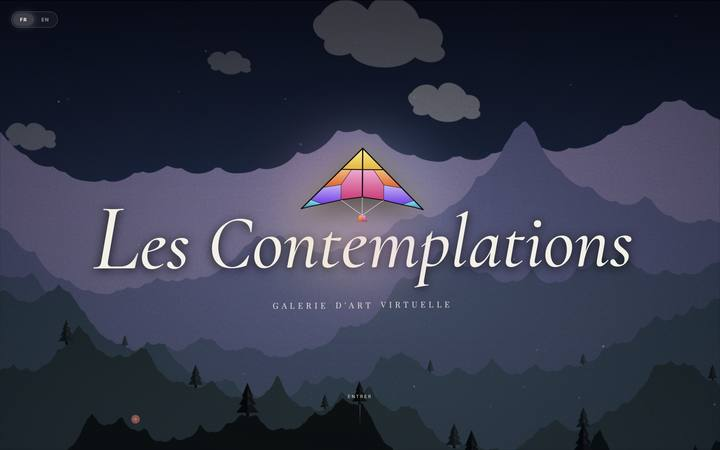

<div align="center">

# Les Contemplations

**An immersive, mood-driven virtual art gallery — built to help people feel better through art.**

[](https://huggingface.co/spaces/aichakorovaev/les-contemplations)
[](LICENSE)



</div>

## Overview

Les Contemplations is a walkable, first-person 3D art gallery that curates a personal itinerary of public-domain paintings based on how the visitor is feeling right now. Tell it your mood; a couple of tags, a few words, or both, and an AI curator selects ten works from a 48-piece catalogue, arranges them across four themed rooms, and writes a short, warm introduction and a per-painting reflection that ties each piece back to that feeling. Come back tomorrow with the same mood and you'll get a different, equally fitting walk through the collection.

The goal isn't just to display paintings, it's to give people a few quiet, guided minutes with art that meets them where they are, and gently nudges them toward feeling a little better.

**[→ Try the live demo](https://aichakorovaev-les-contemplations.hf.space)**

## Features

- **Mood-driven curation** : free text + mood tags are sent to Gemini, which picks a resonant selection of works, writes a poetic welcome, and generates a short meditation, an anecdote and two contemplation questions for each painting.
- **Daily variation** : a day-seeded shuffle means the same mood surfaces a fresh set of works each day instead of always the same "greatest hits."
- **Walkable 3D gallery** : four themed rooms (48 works, 20 wall slots) rendered in Three.js, with a first-person walk/look camera, minimap, and per-painting spotlighting.
- **Guided contemplation** : an on-demand AI "guide" annotates details directly on the canvas, and each painting can be read aloud (Microsoft Edge TTS) in a warm, unhurried voice.
- **Self-healing artwork sourcing** : paintings are fetched live from Wikimedia Commons; if a named file has moved or been renamed, the app automatically searches Commons by artist + title to recover a working image instead of showing a blank frame.
- **Bilingual** : full French/English interface, with the AI curator writing in whichever language is active.
- **Procedural landing scene** : a hand-rolled Canvas 2D landscape (layered fractal-noise terrain, drifting fog, stars) with a physics-based kite that reacts to cursor velocity.

### Built-in care & safety guardrails

Because the app is explicitly positioned as a mental-health-supportive space, it ships with a few deliberate guardrails rather than leaving that to chance:

- **Distress detection on the mood input** : if the free-text mood field contains language associated with suicidal ideation or self-harm (French & English), the app pauses and surfaces a resource card with crisis lines for France, Belgium, Switzerland, Canada, the UK, the US, and a worldwide directory — without blocking the person from continuing if they choose to.
- **Sensitive-content gate** : the handful of works in the catalogue that include artistic nudity or graphic/disturbing scenes (7 and 2 respectively) stay blurred behind an explicit age + willingness gate. Accepting is deliberately *not* the visually emphasized option, requires a few seconds of mandatory pause before it can even be clicked, and the choice is never remembered between visits — each new gallery asks again.
- **Tone guardrails on generated text** : the prompts sent to Gemini explicitly instruct it to stay warm and hope-oriented even when the visitor's mood is dark, and to never mirror that darkness back as morbid or fatalistic imagery.


## Tech stack

The app is intentionally framework-free on the front end — a single, hand-rolled `index.html` — paired with a very small Python backend.

| Layer | Technology |
|---|---|
| 3D gallery | [Three.js](https://threejs.org/) (r160, loaded via import map / CDN) |
| Landing page & minimap | HTML5 Canvas 2D API (procedural terrain, fog, kite physics) |
| Frontend | Vanilla JavaScript (ES modules), hand-written CSS — no framework |
| AI curation & writing | [Google Gemini API](https://ai.google.dev/) (`gemini-3.1-flash-lite`) |
| Voice narration | [`edge-tts`](https://github.com/rany2/edge-tts) (Microsoft Edge neural voices, free) |
| Artwork sourcing | [Wikimedia Commons API](https://commons.wikimedia.org/) |
| Backend | [FastAPI](https://fastapi.tiangolo.com/) (Python) — serves the page and proxies TTS |
| Deployment | Docker, hosted on [Hugging Face Spaces](https://huggingface.co/spaces) |

> If you've seen this project described elsewhere as React/Tailwind/Framer Motion, that reflects an earlier plan, not the shipped app. The actual gallery is vanilla JS + Three.js on top of Canvas 2D, which is what this README (and the code) describes.

## Project structure

```
les-contemplations/
├── index.html      # the entire frontend: markup, styles, 3D gallery, landing scene, AI calls
├── app.py          # FastAPI backend: serves index.html, injects API keys, proxies /tts
├── Dockerfile       # container definition for Hugging Face Spaces
├── .gitattributes
├── LICENSE
└── assets/
    └── screenshot.jpg
```

## Running it locally

**Requirements:** Python 3.11+, a [Gemini API key](https://ai.google.dev/).

```bash
git clone https://github.com/<your-username>/les-contemplations.git
cd les-contemplations

pip install fastapi uvicorn edge-tts

export GEMINI_API_KEY="your-key-here"

uvicorn app:app --host 0.0.0.0 --port 7860
```

Then open `http://localhost:7860`.

### With Docker

```bash
docker build -t les-contemplations .
docker run -p 7860:7860 -e GEMINI_API_KEY="your-key-here" les-contemplations
```

### Deploying on Hugging Face Spaces

1. Create a new **Docker** Space.
2. Push this repo to it (or link it as the Space's Git remote).
3. Add `GEMINI_API_KEY` under **Settings → Repository secrets**.
4. The Space builds from the `Dockerfile` and serves on port `7860` automatically.

> **Note on the demo link above:** use the Space's public URL (`huggingface.co/spaces/<user>/<space>` or its `.hf.space` root), not a `?__sign=...` URL — those are short-lived, session-signed preview links that expire within a day and aren't meant for permanent sharing.

## Artworks & attribution

All paintings are sourced live from [Wikimedia Commons](https://commons.wikimedia.org/) and are in the public domain or under a Commons-compatible license. The app does not host or redistribute image files — it fetches them from Commons at runtime and displays the source museum/artist/year alongside each work.

## Roadmap ideas
- More tests to check if the paintings recommended are always tone and age appropriate.
- Broaden the sensitive-content review to the full catalogue (currently focused on the most clear-cut cases).
- Add more Wikimedia `searchTitle` overrides for non-French-titled works, so the self-healing fallback works reliably even for translated titles.
- Persist favourite works or a visit journal (currently every visit starts fresh, by design).

## License

The source code is MIT-licensed — see [LICENSE](LICENSE). Artwork reproductions remain subject to their original Wikimedia Commons terms.
